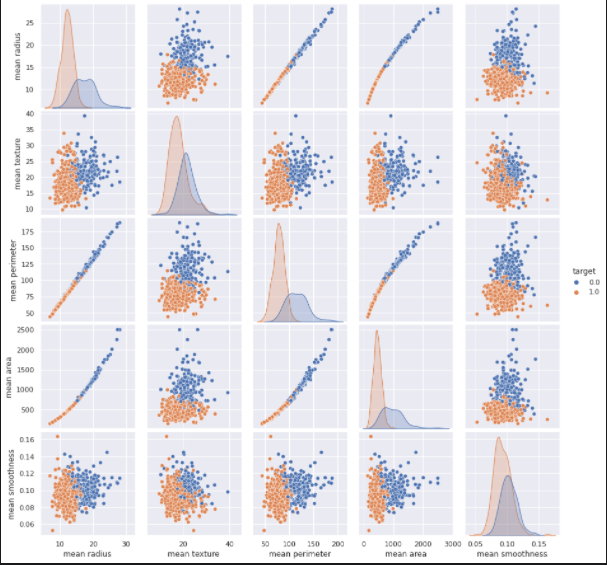
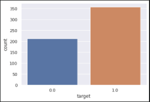
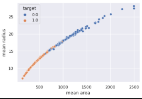
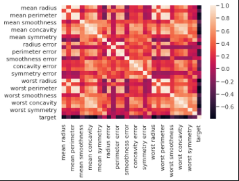
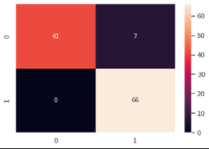

# Breast-cancer-classification

## Environment and tools

1. Jupyter Notebook
2. Numpy
3. Pandas
4. Scikit-image
5. Matplotlib
6. Scikit-learn
7. Keras

## Installation

`pip install numpy pandas scikit-image matplotlib scikit-learn keras`

`jupyter notebook`

## Results

### Pairplot

### Countplot

### Scatterplot

### Heatmap

### Confusion Matrix

## References

1. https://peerj.com/articles/6201.pdf

2. https://arxiv.org/pdf/1811.04241

3. https://www.ncbi.nlm.nih.gov/pmc/articles/PMC6440620/

